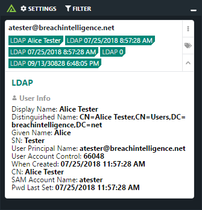

# Polarity LDAP Integration


> Important: We recommend testing this integration against a dev instance of your LDAP setup prior to connecting to a production LDAP system.  This is to ensure the queries do not overload your production LDAP server.  If a dev instance of your LDAP server is not available, we recommend setting this integration to run **On Demand Only** while it is undergoing testing.

> The LDAP integration is a successor to the previous ActiveDirectory integration which has been deprecated.  New users should install the LDAP integration as it is more configurable and significantly more performant when querying your LDAP server due to the use of connection pooling.

The Polarity LDAP integration allows Polarity to search LDAP for user information.  

|  |
|---|
|*LDAP Example*|

## Connection Pooling

This integration makes use of connection pooling. This means the integration will maintain a pool of bound connections with your LDAP server.  When a new lookup request is received, one of the pooled connections will be used and then returned to the connection pool.  

## LDAP Integration Options

### LDAP Server URL

*Admin Only Setting* | *Changes Require Integration Restart*

URL for your LDAP server. This setting must be configured as an **admin-only setting** (i.e., each user cannot set their own value).  In addition, if you modify this value, you will need to restart the integration to ensure the connection pool is recreated.

For example:

```
ldap://dc.domain.com
```
or
```
ldaps://dc.domain.com
```

### Bind Distinguished Name

*Admin Only Setting* | *Changes Require Integration Restart*

The distinguished name that the integration will attempt to bind (authenticate) as. This setting must be configured as an **admin-only setting** (i.e., each user cannot set their own value). In addition, if you modify this value, you will need to restart the integration to ensure the connection pool is recreated.

For example:

```
uid=tony.stark,ou=Users,o=5be4c382c583e54de6a3ff52,dc=jumpcloud,dc=com
```

### Password

*Admin Only Setting* | *Changes Require Integration Restart*

The LDAP Account Password for the provided `Bind Distinguished Name`. This setting must be configured as an **admin-only setting** (i.e., each user cannot set their own value). In addition, if you modify this value, you will need to restart the integration to ensure the connection pool is recreated.

### Maximum Connection Pool Size

*Admin Only Setting* | *Changes Require Integration Restart*

The maximum number of pooled LDAP connections that will be maintained by the integration. If all pooled connections are in use new lookup requests will be queued (if too many requests are queued the integration will drop the request and report an error).  This option defaults to 10 but should be increased for larger deployments.  In general, you should have at least 1 connection per active integration user. 

> If you encounter the error "max waitingClients count exceeded" you will need to increase the maximum connection pool size.  


### Search Distinguished Name

The distinguished name from where searches will start.  The integration will search the whole sub tree under the provided distinguished name.

```
ou=Users,o=5be4c382c583e54de6a3ff52,dc=jumpcloud,dc=com
```

### User Email Search Attribute

The search attribute for user objects (case sensitive).  This attribute should be an email address and will be compared against the email address being looked up.  Typical values are `userPrincipalName`, `distinguishedName`, `sAMAccountName`, or `mail`.  If this option is left blank, the `Advanced Search Filter` below will be used.

Attribute searches are case insensitive.

### Advanced Search Filter (Optional)

The search filter used to identify the user object to be displayed by the integration.  If left blank, a strict equality check will be done against the attribute specified by the `User Email Search Attribute`. An example search filter to search two different attributes would be:

```
(|(mail={{entity}})(sAMAccountName={{entity}}))
```

Attribute searches are case insensitive.

> Note that `{{entity}}` will be replaced with the value of the entity being looked up.

### Summary User Attributes

One or more user attributes you would like to display in the summary portion of the integration.  If the attribute you would like to display is not listed, you can add a custom attribute using the `Custom Summary User Attributes` option.

### Custom Summary User Attributes

Custom user attributes you would like to display in the summary portion of the integration.  Provide a comma delimited list. Attributes are case sensitive.  Attributes provided in this setting will be displayed along with attributes selected for the `Summary User Attributes`.

### Detailed User Attributes

One or more user attributes you would like to display in the details portion of the integration

### Custom Detailed User Attributes

Custom user attributes you would like to display in the details portion of the integration.  Provide a comma delimited list. Attributes are case sensitive.


## Common Errors

### Invalid LDAP Server URL

If you see the below error the LDAP Server URL is probably incorrect.  Please double check the URL and ensure you have connectivity to the URL from the server.

```
getaddrinfo ENOTFOUND <LDAP Server URL>
```

### Invalid Credentials

If your setting for `Bind Distinguished Name` or `Password` are incorrect, you will see the following error: 

```
Invalid credentials during a bind operation. Code: 0x31
```

### Invalid Search DN

If your `Search DN` setting is invalid or cannot be found, you will likely see the following error:

```
 Unknown error. Code: 0xa (err.code=10)
```

### Connection Pool Exhausted

If you see the following error it means you need to increase the size of your connection pool via the `Maximum Connection Pool Size`.  

```
max waitingClients count exceeded
```

### Disconnected LDAP Client Connection

The integration attempts to validate that LDAP connections are still connected prior to using them.  In some rare circumstances this validation may return a false positive and the connection will attempt to be used even when it is no longer connected (e.g., because of an idle connection timeout setting on your LDAP server).  If this happens, you will likely see the following error: 

```
Request was out of sequence with another operation in progress. Code: 0x1
```

When this error occurs the client will be removed from the connection pool.

> This error will usually occur after the integration has been running for a while.

### Search Distinguished Name

If your `Search Distinguised Name` option is invalid you can also see the following error: 

```
Request was out of sequence with another operation in progress. Code: 0x1
```

Please make sure your Search Distinguished Name is valid DN

```
// Valid Search DN
cn=Users,dc=breachintelligence,dc=net

// Invalid Search DN
cn=Users
```

You can distinguish this error from the `Disconnected LDAP Client Connection` because it will happen right away on the first search after restarting the integration.

### Timeout Waiting for new LDAP Client

The integration makes use of a connection pool.  Once the maximum number of clients are checked from the pool additional requests are put into a queue.  If a request has to wait longer than 5 seconds before getting a connection, the request will time out and you will see the below error: 

```
ResourceRequest timed out
```

Note that internally this time out duration is controlled by the `acquireTimeoutMillis` configuration option on the LDAP client object (this setting is not exposed via integration options).

You can typically resolve this error by increasing the `Maximum Connection Pool Size` option.  If you're running the integration in real-time, you can also reduce the amount of requests by setting the integration to On-Demand Only.

## Installation Instructions

Installation instructions for integrations are provided on the [PolarityIO GitHub Page](https://polarityio.github.io/).

## Polarity

Polarity is a memory-augmentation platform that improves and accelerates analyst decision making.  For more information about the Polarity platform please see:

https://polarity.io/
